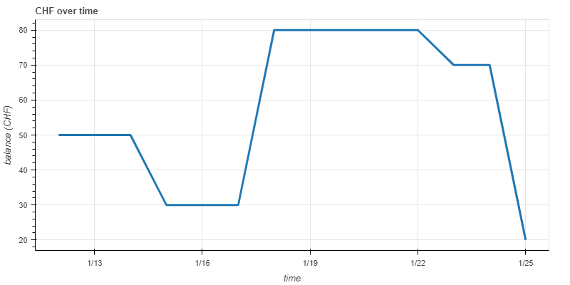
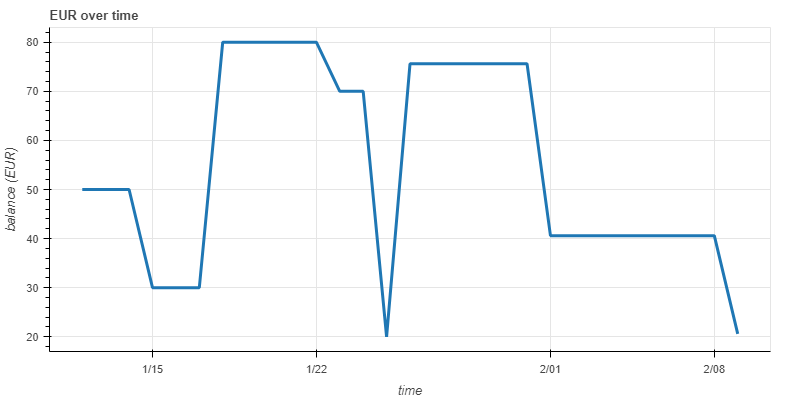

# Revolut Analysis

Python 3 script to analyse Revolut transactions.

This script can:

 - display balance over time charts

 - check for errors in your Revolut statements

 - get end of day balance at given date

 - get average balance in a given year (calculated as the mean average of the balances at the end of the day over one year)

The last two are especially useful if you need to fill the italian ISEE report.

## Chart

The script can plot similar charts to the two below.

Click on either chart to be redirected to the interactive version.

[]()

[]()

## How to run it

The script can either be used in interactive mode or by supplying one optional argument from the command line.

To run the script in interactive mode execute the following command in the Revolut-Analysis folder:

```bash
./src/main.py STATEMENT_PATH [STATEMENT_PATH ...]
```

where `STATEMENT_PATH` is the path of your Revolut statement (csv or txt format).

You can generate a statement in the Revolut app for each currency that you own.

Some examples of csv statements can be found in the folder examples.

## Interactive menu

If the script is executed without any optional argument a menu will show up guiding you through the different functionalities of the script.

```bash
Chose one of the following options:
  1 - Display balance over time chart
  2 - Check for errors in the statements
  3 - Get end of day balance at given date
  4 - Get average balance in a given year (calculated as the mean average of the balances at the end of the day over one year)
  5 - Exit
```

## Optional arguments

The full list of optional arguments can be display by executing `./src/main.py --help`.

```bash
usage: main.py [-h] [--show-chart] [--save-chart] [--check-errors]
               [--get-balance [GET_BALANCE]]
               [--average-balance [AVERAGE_BALANCE]]
               N [N ...]

Analyse Revolut transactions.

positional arguments:
  N                     statement filename

optional arguments:
  -h, --help            show this help message and exit
  --show-chart          display the balance charts
  --save-chart          save the balance charts in the out folder
  --check-errors        check for errors in the statements
  --get-balance [GET_BALANCE]
                        get balance at given date; default: last day of last
                        year
  --average-balance [AVERAGE_BALANCE]
                        get mean average balance in a given year
```